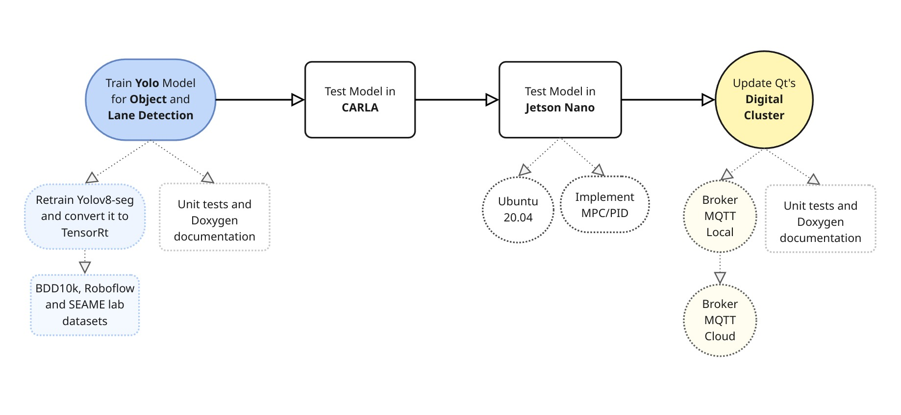
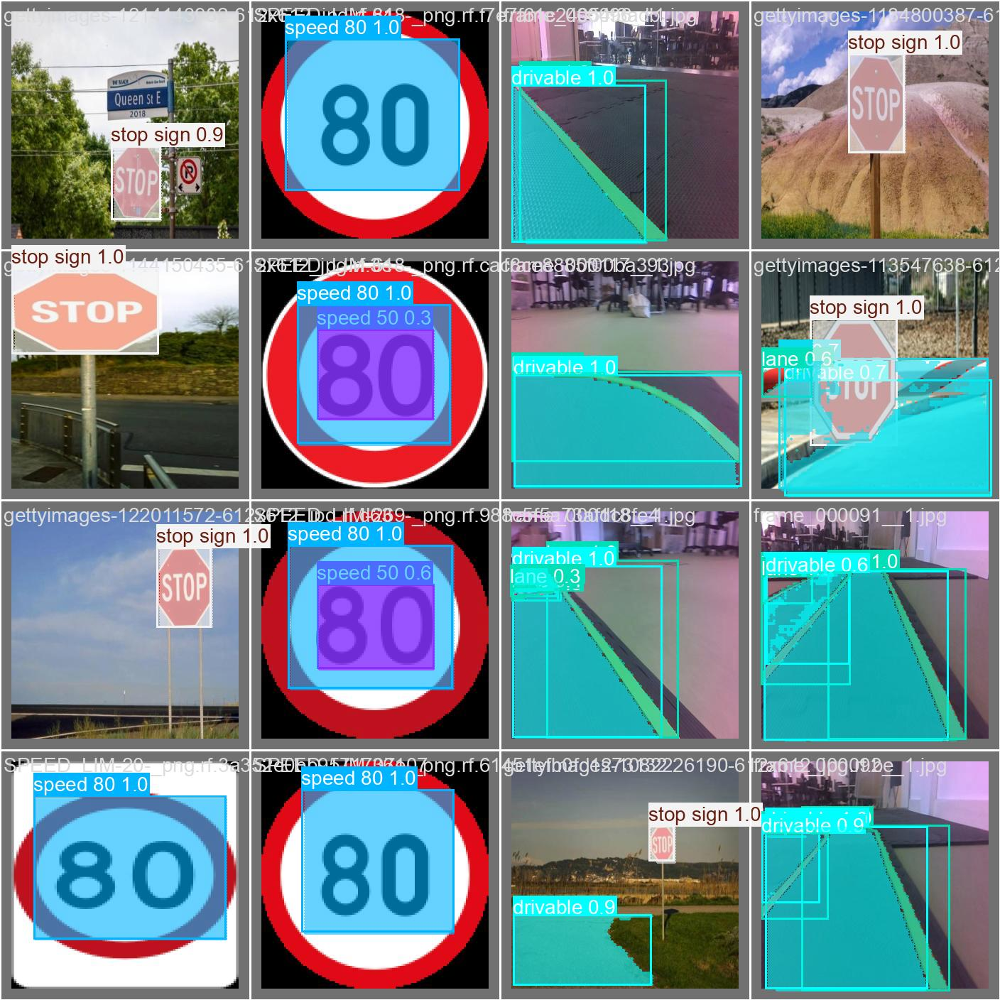

# Object Detection and Avoidance

You can find our **best models** in dev branch, *models/yolo-object-lane-unfroze/weights/*.

Training a Yolo Object detection model, with **Lane detection (segmentation)** as well.

## Inference Result

This image is a result of running *testing.py*, so running predict() of our model. The **lane points** (polygons, mask) are in blue.

## Datasets

You can download our dataset here: [Click to access our dataset](https://drive.google.com/drive/folders/1RwFmYyjxCafdnUORBcm2kgo62itcLmcS?usp=drive_link).

For lane and drivable area detection, we took some images of our lab and also used the bdd10k dataset. For the objects, we downloaded some datasets from Roboflow.

 <!-- few images from dataset8, you can find in this link: [Link to CARLA dataset](https://onedrive.live.com/?id=4EF9629CA3CB4B5E%213022&cid=4EF9629CA3CB4B5E&redeem=aHR0cHM6Ly8xZHJ2Lm1zL3UvcyFBbDVMeTZPY1l2bE9sMDQxNHNSb3BGVkgyOTVXP2U9Q2pjbDYy). -->

I noticed a decay of object detection outside the objects of my dataset, despite the fact that i froze the backbone and lowered the learning rate. So you might need to add some object images to preserve more information.

### Roboflow

To create the masks of our lab images, we used Roboflow to generate the annotations, then we added blur, noise and grayscale to the images and resized them to 320x320, keeping aspect ratio. After this, we downloaded to **COCO segmentation** format. This creates a Json file with all the annotations. So, in *scripts/json_txt.py* we convert these annotations, that have the polygons of the lanes into binary masks, so we can then convert them back to normalized polygons and save them to a txt file. We tried to convert the COCO polygons directly to yolo-seg txt format but we noticed some weird values and loss of information. Therefore, converting first to binary masks helped preserve the lane shape.

We downloaded a few Roboflow datasets of road objects, such as the **traffic lights, the stop, speed, danger and cross walk signs**. We then used *scripts/remap_polygons.py* to reorder the labels to match our project and *scripts/bbox_seg.py* to transform them into segmentation labels, since this is a segmentation model.

## Creating Annotations

In the scripts directory file *create_annotations.py* we create the **annotation labels** for lane and object detection. How do we do this? We pass our images through a pre-trained **Yolo11-seg model**, to get the object polygons. Then, we use **supervision** tools to convert the lane **binary masks** to valid Yolo **polygons**. Finaly, we **merge** the object and lane annotations and get the label files.

Be attentive towards the size of the images and masks, we decided to keep the images square, (training and testing), for compatibility. In the scripts directory, file *resize.py* you can resize images with **letterboxing** (keeping **aspect ratio**), or not.

In these scripts, you might need to change some function **parameters**, the original size of the images, and the **paths** to the images, so that it correctly links to your dataset and original size of your images.

For debugging, you can **visualize the annotations** in *scripts/visual_annotations.py*.

## Training and Testing

In *training.py* (scripts directory) where we are retraining our model, we set the augmentations to None since it disrupts our images, and add other augmentations that dont disrupt them, such as brightness, saturation and hue. After the first training where we freeze the backbone, you train again to unfreeze everything.

For testing, (in *scripts/testing.py*), we call our trained model and set it to **predict**, to test the prediction of a given validation image.

For debugging we added *scripts/count_labels.py* that outputs how many annotations we have for each class id.

## Jetson Nano

In Jetson, we have an ultralytics Yolo **container**, specific for compatibility with Jetson Nano. This container only runs a yolo model above or equal to version 8. In here we will run our Yolo with lane detection.

We have a self-hosted jetson runner, so that everytime I push the code to github, it will deploy my models to jetson, this code is in *.github/deploy_jetson.yml*.

## Documentation

For more documentation click here: [Doxygen](https://seame-pt.github.io/ObjectDetectionAvoidance/html/index.html).
