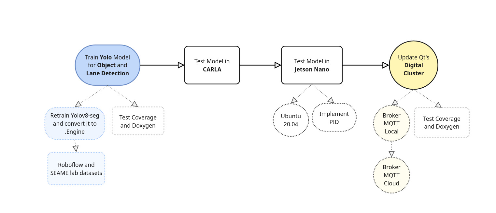
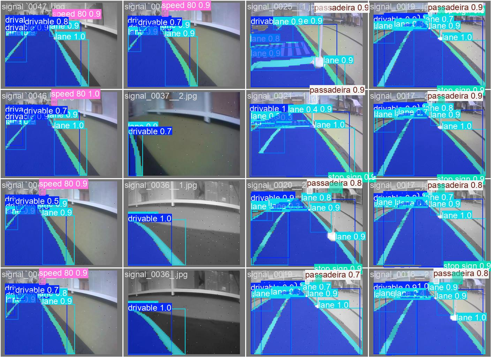

# Object Detection and Avoidance

This project aims to retrain Yolo for **Lane, Drivable Area and Road Object detection** as well.

You can find our **best models** in [this folder](yolo_models/models/). You can also download our model and dataset here: [Link to Google Drive](https://drive.google.com/drive/folders/1RwFmYyjxCafdnUORBcm2kgo62itcLmcS?usp=drive_link). In there you have our full dataset, and separate folders with some of the images we used.



## Inference Result



This image was generated by Yolo, in the validaton step, after training.

## Datasets

For lane and drivable area detection, we took some images of our lab and also used the BDD100K dataset. For the objects, we downloaded some datasets from Roboflow.

### Roboflow

To create the annotations of our lab images, we used Roboflow, we added blur, noise and grayscale to the images and resized them to 320x320, keeping aspect ratio. After this, we downloaded to **COCO segmentation** format. This creates a Json file with all the annotations. So, in [this file](yolo_models/scripts/annotations/coco_txt.py) we convert these annotations, that have the polygons of the lanes in COCO format to yolo-seg txt format.

We downloaded a few Roboflow datasets of road objects, such as the **traffic lights, the stop, speed, danger and cross walk signs**. We then used [this file](yolo_models/scripts/annotations/remap_classid.py) to reorder the labels to match our project and [this file](yolo_models/scripts/annotations/bbox_seg.py) to transform them into segmentation labels, since this is a segmentation model.

Be attentive towards the size of the images and masks, we decided to keep the images square, (training and testing), for compatibility.

If you want to create the annotations from binary masks, we recommend the use of **Supervision** mask_to_polygon(), you might need to thin and smooth the mask for better results:

```python
import supervision
from supervision.detection.utils import mask_to_polygons
```

In these scripts, you might need to change some function **parameters**, the original size of the images, and the **paths** to the images, so that it correctly links to your dataset and size of your images.

For debugging, you can **visualize the annotations** in [this file](yolo_models/scripts/annotations/visual_annotations.py).

## Training and Testing

In [this file](yolo_models/scripts/training.py) we are retraining the model, setting augmentations to the images. Be carefull with the augmentations you set because it might disrupt segmentation/object classification.
We first train with the BDD100K images, with lane, drivable area and other objects. Then, we retrain with the images of the SEAME lab and other road objects/signs.

For testing, (in [this file](yolo_models/scripts/testing.py)), we call our model and set it to **predict**, to test the prediction of a given validation image. You can also view the model metrics such as the MAP50.

For debugging we added [this file](yolo_models/scripts/annotations/count_labels.py) that outputs how many annotations we have for each class id.

## Jetson Nano

### YOLO Inference on Jetson Nano – Performance Improvements and Benchmarks

This project documents the key improvements and testing results when running various versions of YOLO on the Jetson Nano. The main goal was to maximize the inference speed (FPS) while using limited hardware resources.

---

#### Key Improvements

#### 1. Upgrading to Ubuntu 20.04
To unlock better compatibility and performance, the default OS was upgraded to **Ubuntu 20.04**, following this image and guide by Qengineering:

👉 [Qengineering Jetson Nano Ubuntu 20.04 Image](https://github.com/Qengineering/Jetson-Nano-Ubuntu-20-image)

This enabled smoother installation of recent dependencies, CUDA support, and improved system stability.

---

#### 2. Converting YOLO to TensorRT
The second major improvement was converting YOLO models to **TensorRT** using the `tensorrtx` repository:

👉 [Tensorrtx YOLOv5 Conversion (v7.0)](https://github.com/wang-xinyu/tensorrtx/tree/yolov5-v7.0)

By doing so, we achieved significantly higher inference performance using the Jetson's GPU and Tensor cores, particularly with small and segmentation models.

---

#### Benchmark Results

| Environment                              | YOLO Version   | Frames/s | Type cam | Framework             |
|------------------------------------------|----------------|----------|----------|------------------------|
| Container Ultralytics (Jetson nano 18.04) | v11 nano       | 6.94     | USB      | Pytorch                |
| Container Ultralytics (Jetson nano 18.04) | v8 nano        | 12.66    | USB      | Pytorch                |
| Jetson nano Ubuntu 20.04                 | v11 nano       | 12.05    | USB      | Pytorch                |
| Jetson nano Ubuntu 20.04                 | v8 nano        | 14.08    | USB      | Pytorch                |
| Jetson nano Ubuntu 20.04                 | v8 nano        | 15.47    | CSI      | Pytorch                |
| **Jetson nano Ubuntu 20.04**             | **v5 small**   | **47**   | CSI      | **CPP and TensorRT**   |
| Jetson nano Ubuntu 20.04                 | v5 small seg   | 37       | CSI      | CPP and TensorRT       |
| **Jetson nano Ubuntu 20.04**             | **v8 nano seg**| **57**   | Images   | **CPP and TensorRT**   |

---

#### Summary

- Upgrading to **Ubuntu 20.04** greatly improved system support and performance.
- Converting models to **TensorRT** delivered **3x to 4x speedup** in FPS.
- The best result was with **YOLOv8 nano segmentation (TensorRT)** at **57 FPS** using preloaded images.
- **CSI cameras** outperform USB in most live camera inference scenarios.

---

#### Recommendations

- For maximum performance: use **TensorRT + CSI camera**.
- For segmentation tasks: consider using YOLOv5 or v8 nano models with `tensorrtx`.
- Avoid using Docker unless strictly needed, as native Ubuntu 20.04 offers better access to CUDA/TensorRT features.

---

Tested on: **Jetson Nano 4GB**, Ubuntu 20.04, JetPack 4.x, CUDA, cuDNN, TensorRT.

## Documentation

To see more Documentation on the PID control go to [this file](pid_control/README.md).

To see a more structured Documentation go to [Doxygen](https://seame-pt.github.io/ObjectDetectionAvoidance/).
