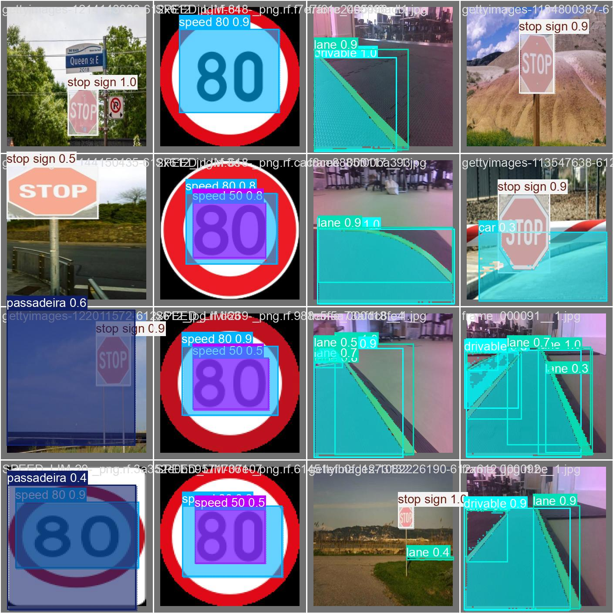

# Object Detection and Avoidance

You can find our **best models** in dev branch, *models/yolo-object-lane-unfroze/weights/*.

Training a Yolo Object detection model, with **Lane detection (segmentation)** as well.

## Inference Result

This image was generated by yolo, in the image validaton step, after training.

<!-- This image is a result of running *testing.py*, so running predict() of our model. The **lane points** (polygons, mask) are in blue. -->

## Datasets

You can download our dataset here: [Click to access our dataset](https://drive.google.com/drive/folders/1RwFmYyjxCafdnUORBcm2kgo62itcLmcS?usp=drive_link).

For lane and drivable area detection, we took some images of our lab and also used the bdd10k dataset. For the objects, we downloaded some datasets from Roboflow.

I noticed a decay of object detection outside the objects of my dataset, despite the fact that i froze the backbone and lowered the learning rate. So you might need to add some object images to preserve more information.

### Roboflow

To create the masks of our lab images, we used Roboflow to generate the annotations, then we added blur, noise and grayscale to the images and resized them to 320x320, keeping aspect ratio. After this, we downloaded to **COCO segmentation** format. This creates a Json file with all the annotations. So, in *scripts/coco_txt.py* we convert these annotations, that have the polygons of the lanes in COCO format to yolo-seg txt format.

We downloaded a few Roboflow datasets of road objects, such as the **traffic lights, the stop, speed, danger and cross walk signs**. We then used *scripts/remap_polygons.py* to reorder the labels to match our project and *scripts/bbox_seg.py* to transform them into segmentation labels, since this is a segmentation model.

## Creating Annotations

In the scripts directory file *create_annotations.py* we create the **annotation labels** for lane and object detection. How do we do this? We pass our images through a pre-trained **Yolo11-seg model**, to get the object polygons. Then, we use **supervision** tools to convert the lane **binary masks** to valid Yolo **polygons**. Finaly, we **merge** the object and lane annotations and get the label files.

Be attentive towards the size of the images and masks, we decided to keep the images square, (training and testing), for compatibility. In the scripts directory, file *resize.py* you can resize images with **letterboxing** (keeping **aspect ratio**), or not.

In these scripts, you might need to change some function **parameters**, the original size of the images, and the **paths** to the images, so that it correctly links to your dataset and original size of your images.

For debugging, you can **visualize the annotations** in *scripts/visual_annotations.py*.

## Training and Testing

In *training.py* (scripts directory) where we are retraining our model, we set the augmentations to None since it disrupts our images, and add other augmentations that dont disrupt them, such as brightness, saturation and hue. After the first training where we freeze the backbone, you train again to unfreeze everything.

For testing, (in *scripts/testing.py*), we call our trained model and set it to **predict**, to test the prediction of a given validation image.

For debugging we added *scripts/count_labels.py* that outputs how many annotations we have for each class id.

## Jetson Nano

### YOLO Inference on Jetson Nano – Performance Improvements and Benchmarks

This project documents the key improvements and testing results when running various versions of YOLO on the Jetson Nano. The main goal was to maximize the inference speed (FPS) while using limited hardware resources.

---

#### Key Improvements

#### 1. Upgrading to Ubuntu 20.04
To unlock better compatibility and performance, the default OS was upgraded to **Ubuntu 20.04**, following this image and guide by Qengineering:

👉 [Qengineering Jetson Nano Ubuntu 20.04 Image](https://github.com/Qengineering/Jetson-Nano-Ubuntu-20-image)

This enabled smoother installation of recent dependencies, CUDA support, and improved system stability.

---

#### 2. Converting YOLO to TensorRT
The second major improvement was converting YOLO models to **TensorRT** using the `tensorrtx` repository:

👉 [Tensorrtx YOLOv5 Conversion (v7.0)](https://github.com/wang-xinyu/tensorrtx/tree/yolov5-v7.0)

By doing so, we achieved significantly higher inference performance using the Jetson's GPU and Tensor cores, particularly with small and segmentation models.

---

#### Benchmark Results

| Environment                              | YOLO Version   | Frames/s | Type cam | Framework             |
|------------------------------------------|----------------|----------|----------|------------------------|
| Container Ultralytics (Jetson nano 18.04) | v11 nano       | 6.94     | USB      | Pytorch                |
| Container Ultralytics (Jetson nano 18.04) | v8 nano        | 12.66    | USB      | Pytorch                |
| Jetson nano Ubuntu 20.04                 | v11 nano       | 12.05    | USB      | Pytorch                |
| Jetson nano Ubuntu 20.04                 | v8 nano        | 14.08    | USB      | Pytorch                |
| Jetson nano Ubuntu 20.04                 | v8 nano        | 15.47    | CSI      | Pytorch                |
| **Jetson nano Ubuntu 20.04**             | **v5 small**   | **47**   | CSI      | **CPP and TensorRT**   |
| Jetson nano Ubuntu 20.04                 | v5 small seg   | 37       | CSI      | CPP and TensorRT       |
| **Jetson nano Ubuntu 20.04**             | **v8 nano seg**| **57**   | Images   | **CPP and TensorRT**   |

---

#### Summary

- Upgrading to **Ubuntu 20.04** greatly improved system support and performance.
- Converting models to **TensorRT** delivered **3x to 4x speedup** in FPS.
- The best result was with **YOLOv8 nano segmentation (TensorRT)** at **57 FPS** using preloaded images.
- **CSI cameras** outperform USB in most live camera inference scenarios.

---

#### Recommendations

- For maximum performance: use **TensorRT + CSI camera**.
- For segmentation tasks: consider using YOLOv5 or v8 nano models with `tensorrtx`.
- Avoid using Docker unless strictly needed, as native Ubuntu 20.04 offers better access to CUDA/TensorRT features.

---

Tested on: **Jetson Nano 4GB**, Ubuntu 20.04, JetPack 4.x, CUDA, cuDNN, TensorRT.
