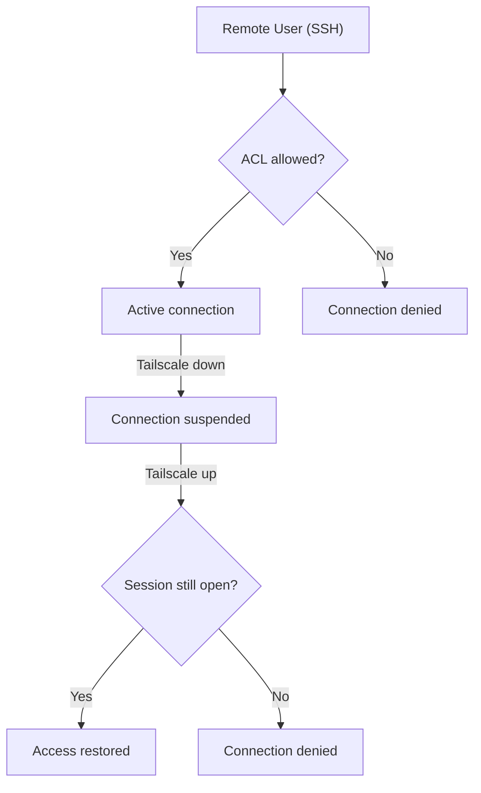

# Documentation: VPN with Tailscale

## Index

1. [What is a VPN?](#what-is-a-vpn)
2. [What is WireGuard?](#what-is-wireguard)
3. [What is Tailscale?](#what-is-tailscale)
4. [Practical Use Case](#practical-use-case)
5. [Installing Tailscale on Linux](#installing-tailscale-on-linux)
6. [Tailnet Operation and Management](#tailnet-operation-and-management)
7. [Access Control (ACL)](#access-control-acl)
8. [Immediate Disconnection of Active Sessions](#immediate-disconnection-of-active-sessions)
9. [Security Notes](#security-notes)
10. [Best Practices Summary](#best-practices-summary)

---

## What is a VPN?

A **VPN (Virtual Private Network)** creates an **encrypted tunnel** between two or more devices over the internet, as if they were all on the same local network.

**Used for:**
- Secure remote access to machines and servers.
- Protecting data on public networks (e.g., coffee shop Wi-Fi).
- Connecting devices in private networks (e.g., lab ↔ home).

---

## What is WireGuard?

**WireGuard** is an open-source network tunneling protocol that implements a VPN using modern cryptography.
It operates at layer 3 (network/IP) and allows secure peer-to-peer connections between devices.

### What is it for?

- Secure connections between devices, even over insecure networks.
- Secure access to corporate or home networks.
- Creating encrypted tunnels to protect data traffic.
- Setting up private networks between servers, containers, mobile devices, etc.

### Advantages
| Advantage           | Description                                                    |
|---------------------|----------------------------------------------------------------|
| **High security**   | Uses modern, secure-by-default cryptography.                   |
| **High performance**| Fast, low overhead, and efficient.                             |
| **Simplicity**      | Minimal configuration (no XML, no large scripts).              |
| **Portability**     | Runs on Linux, Windows, macOS, Android, iOS.                   |
| **Kernel module**   | Runs in-kernel on Linux → maximum speed.                       |
| **Lightweight**     | Small, auditable codebase.                                     |

WireGuard creates **encrypted peer-to-peer connections** using public and private keys, enabling secure communication between devices.

---

## What is Tailscale?

**Tailscale** is a service that builds a private peer-to-peer network between devices using WireGuard for encryption.
It forms a mesh VPN, meaning devices can connect directly without a central server (unless NAT/firewalls block direct paths).

### What is it for?

- Remote access to devices like servers, laptops, or IoT.
- Creating secure private networks, even over public or unsafe connections.
- Replacing traditional VPNs.
- Connecting servers across multiple clouds (e.g., AWS ↔ GCP ↔ local machine).
- Linking remote teams without firewall/router/server setup.

### How does it work?

- Installation:
Install Tailscale on each device (Linux, Windows, macOS, Android, iOS, etc.).

- Identity login:
Log in with your Google, Microsoft, GitHub, etc. account. Tailscale uses this to associate the device with your private network (called a Tailnet).

- Mesh network creation:
Tailscale connects devices directly using peer-to-peer. If NAT/firewall blocks it, it uses the DERP relay server as a fallback.

- Encryption:
All communication is end-to-end encrypted using WireGuard for security and privacy.

- Fixed IP access:
Each device gets a virtual IP (e.g., 100.64.x.x) usable as if in a LAN.

**Advantages:**
- Zero config: no need for firewall/router/public IP setup.
- Easy login: via Google, GitHub, etc.
- Access control: supports ACLs for fine-grained permissions.
- Fast and lightweight: built on WireGuard.
- Secure: end-to-end encryption.
- Cross-platform: works on almost any OS.

---

## Practical Use Case

### Devices in the team's network:

- `server_1` and `server_2` → PCs with shared resources.
- `user_a`, `user_b`, `user_c`, `user_d`, etc. → Team members' personal laptops.

### Objective:

- Everyone can access the **server PCs**.
- **Personal laptops must remain private** (no remote access by others).

---

## Installing Tailscale on Linux

### Via Snap (Ubuntu 24.04+):
```bash
sudo snap install tailscale
```

### Activation:
```bash
sudo tailscale up
```

A browser will open for login (Google, GitHub, etc.).

### View Tailscale IP:
```bash
tailscale ip -4
```

---

## Tailnet Operation and Management

- Each authenticated device appears in the admin panel:  
  https://login.tailscale.com/admin/machines
- Receives a private IP `100.x.x.x`
- Can be accessed directly: `ssh user@100.x.x.x`

---

## Access Control (ACL)

### Problem:

By default, all devices in a Tailnet can access each other.

### Solution:

Edit the **ACLs (Access Control Lists)** to allow access only to authorized devices:

### Example ACL allowing access only to team devices:

```json
{
  "grants": [
    {
      "src": ["autogroup:member"],
      "dst": [
        "100.X.X.1",
        "100.X.X.2"
      ],
      "ip": ["*"]
    }
  ],
  "ssh": [
    {
      "action": "check",
      "src": ["autogroup:member"],
      "dst": ["autogroup:self"],
      "users": ["autogroup:nonroot", "root"]
    }
  ]
}
```

> The IPs above are the Tailscale IPs of the team devices.  
> Personal laptops **not listed** will automatically be **inaccessible**.

---

## Immediate Disconnection of Active Sessions

### Problem:

If someone is **already connected before new ACLs**, the session stays active.

### Effective solution:

#### Use `ss` + `kill` by IP:

```bash
sudo ss -tnp | grep <IP>
sudo kill <PID>
```

This terminates the SSH connection for the remote IP.

#### Unreliable alternative: `tailscale down/up`

```bash
sudo tailscale down
sudo tailscale up
```

> **Warning**: See security note below.

---

## Security Notes: `tailscale down/up` Limitations

During tests, an important behavior was observed:

### Problem with `sudo tailscale down` on the target device

**Scenario:**
- `REMOTE_USER` is connected to `TARGET_DEV` via SSH.
- The admin of `TARGET_DEV` runs `sudo tailscale down`.



**Result:**
- `REMOTE_USER` **cannot type new commands**.
- However, if they **keep the SSH session open**, and `TARGET_DEV` runs `sudo tailscale up` again, `REMOTE_USER` **regains full access**, **even if their IP was removed from ACLs**.

### Conclusion:

- **`tailscale down` + `up` is NOT enough to block previously established access**.
- The **most secure and effective method** is:
  - Use `sudo ss -tnp | grep <IP>` to locate the active session.
  - Kill the related SSH process using `sudo kill <PID>`.

> **Recommended:** use IP inspection with `ss` + `kill` for immediate and permanent disconnection, enforcing ACL rules.

---

## Best Practices Summary

| Action               | Recommendation                                  |
|----------------------|--------------------------------------------------|
| Install Tailscale    | `snap install tailscale` or official script      |
| Activate VPN         | `sudo tailscale up`                              |
| Check IP             | `tailscale ip -4`                                |
| View devices         | https://login.tailscale.com/admin/machines       |
| Create ACLs          | https://login.tailscale.com/admin/acls           |
| Apply restrictions   | Remove IPs from `dst` list and restart Tailscale |
| Disconnect users     | `ss -tnp` + `kill <PID>` for active sessions     |


| Machine                   | Address       | Version |
|----------------------------|---------------|---------|
| seame-thinkpad-p16-gen-2  | 100.122.103.80 | 18.04   |
| nano                      | 100.101.78.17  | 18.04.3 |
| okdot5-desktop            | 100.125.81.73  | 18.2.5  |
| raspberrypi               | 100.123.70.46  | 18.04   |
| seame-thinkpad-p16-gen-2  | 100.92.243.22  | 18.04   |
| seame-tpad-without-model  | 100.91.145.67  | 18.04   |
