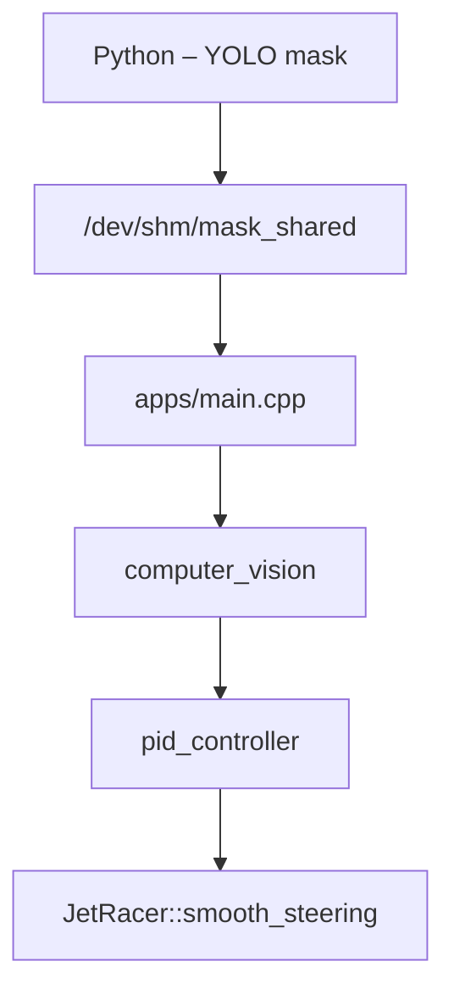

# PID Control + JetRacer Vision

C++ implementation of lane detection, PID control, and hardware interface for the JetRacer car, integrated with a Python pipeline that writes camera segmentation masks to shared memory.

> **Requirements**
> • CMake ≥ 3.18 • OpenCV ≥ 4.5 • SDL2 • Linux I2C (i2c-dev) • Python ≥ 3.9 (for camera_yolo_to_shm.py)

---

## Repository Structure

apps/                # example executables
  └─ main.cpp        # PID with joystick + shared memory
includes/jetracer/   # public headers (*.hpp)
sources/             # C++ implementations (*.cpp)
models/              # YOLO / LaneNet model (.pt)
scripts/             # Python utilities
docs/                # Markdown documentation + diagrams
Makefile             # default target: make && make run

---

## Execution

```bash
# Terminal 1: producer writes lane masks to shared memory
python3 scripts/camera_yolo_to_shm.py

# Terminal 2: run the C++ controller
./bin/jetracer_pid_controler
```

## Testing

```bash
# Compile and test manually
make clean && make
./bin/jetracer_pid_controler
```

---

## Execution Flow (Simplified)



---

## PWM Improvements

The system now includes advanced PWM improvements to eliminate motor speed pulsation:

- **Higher PWM Frequency**: Increased from 100Hz to 1000Hz (configurable up to 2000Hz)
- **Speed Smoothing**: Moving average filter with configurable smoothing window
- **Rate Limiting**: Maximum speed change per update to prevent sudden movements
- **Configurable Parameters**: Easy adjustment for different use cases

## Motor Control Improvements

Advanced motor control system to eliminate "force to start" sound and improve acceleration:

- **Intelligent Power Curve**: Exponential power amplification for better low-speed response
- **Minimum PWM Threshold**: Guaranteed initial torque to eliminate startup resistance
- **Torque Amplification**: Boost for low-speed PWM values
- **Smart Acceleration Ramp**: Different rates for acceleration vs. deceleration
- **Emergency Braking**: Intelligent detection and response to sudden changes
- **Deadzone Control**: Eliminates oscillations at very low speeds
