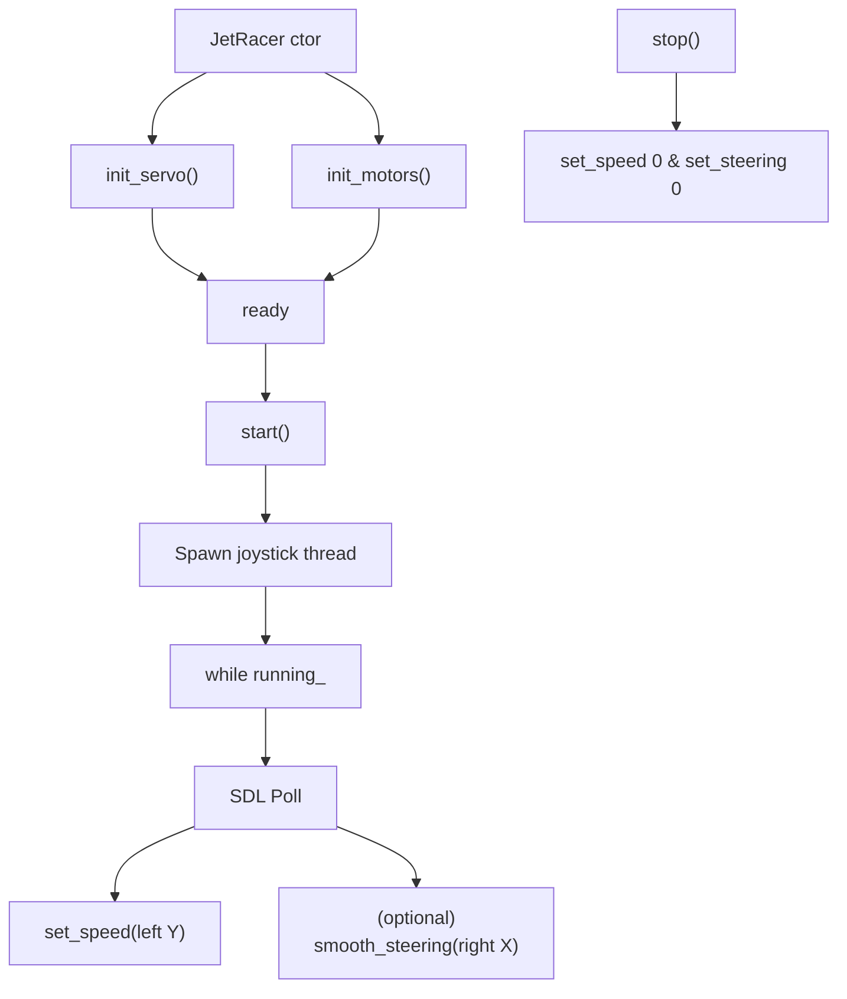
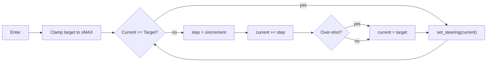

## Documentation – `jetracer::control` module

The `control` module defines the **`JetRacer`** class - a high-level driver that steers and propels the vehicle.  It couples PWM-based hardware control (servo + DC motors) with a joystick interface (SDL2) so that autonomous logic (PID, MPC, etc.) can focus on high-level commands.

---

### Purpose

* Initialise the PWM controllers (PCA9685) that drive the steering servo and the four wheel motors.
* Provide **angle** and **speed** setters with safety clamps.
* Spawn an SDL2 joystick thread for manual override.

---

### Public Interface

| Method                                   | Description                                                           |
| ---------------------------------------- | --------------------------------------------------------------------- |
| `JetRacer(int servoAddr, int motorAddr)` | Opens two `I2CDevice`s, one for the servo PWM board, one for motors.  |
| `void start()`                           | Starts the joystick polling thread (`running_ = true`).               |
| `void stop()`                            | Stops joystick, sets speed = 0 and centres steering.                  |
| `void set_speed(float pct)`              | −100 … +100 % mapped to PWM (internally limited to +30 % for safety). |
| `void set_steering(int deg)`             | Immediate steering command −140 … +140 °.                             |
| `void smooth_steering(int tgt, int inc)` | Gradually moves servo in `inc`-degree steps until `tgt` is reached.   |
| `bool is_running() const`                | Returns current `running_` flag.                                      |

Key data members

| Field            | Type                  | Meaning                              |
| ---------------- | --------------------- | ------------------------------------ |
| `running_`       | `std::atomic<bool>`   | Thread-safe on/off flag              |
| `servo_device_`  | `hardware::I2CDevice` | Low-level I2C helper for servo board |
| `motor_device_`  | `hardware::I2CDevice` | Low-level I2C helper for motor board |
| `current_angle_` | `int`                 | Last angle applied to servo          |
| `current_speed_` | `float`               | Last speed percentage                |

Constants

| Name                | Value | Purpose                                |
| ------------------- | ----- | -------------------------------------- |
| `MAX_ANGLE_`        | 140   | Absolute steering limit (degrees)      |
| `SERVO_LEFT_PWM_`   | 140   | PCA9685 tick count – full left         |
| `SERVO_CENTER_PWM_` | 280   | PCA9685 tick count – centre            |
| `SERVO_RIGHT_PWM_`  | 420   | PCA9685 tick count – full right        |
| `servo_delay_ms_`   | 30    | Sleep between successive servo updates |

---

### High-level execution flow

---

### Internal flow – `smooth_steering()`

---

### Notes

* Uses the `hardware::I2CDevice` helper for raw I2C access.
* Joystick index `0` is assumed; SDL2 must be installed in the system.
* The motor power is capped to 30 % within `set_speed()` to avoid bench accidents.

---

### References

* NVIDIA JetRacer GitHub Wiki.
* SDL2 Joystick API.
* PCA9685 Datasheet.
