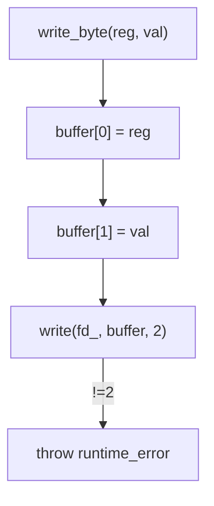
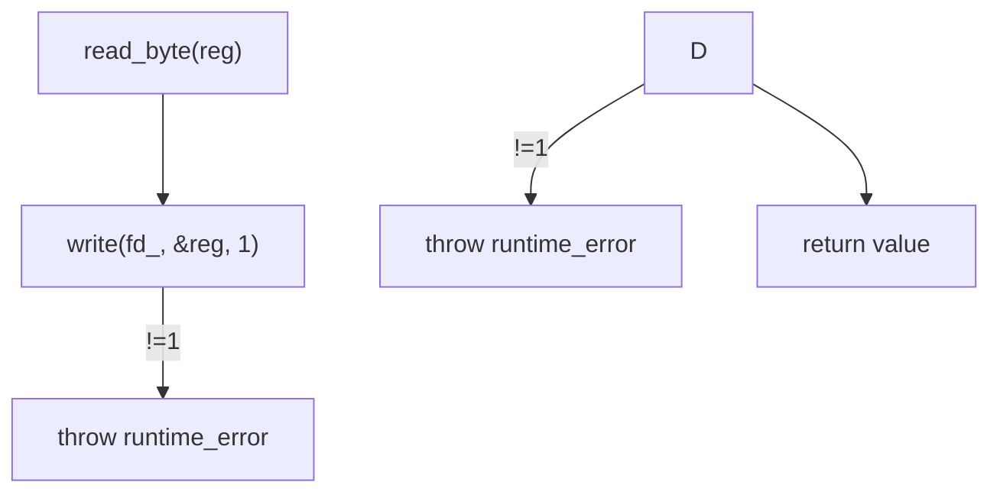

## Documentation – `jetracer::hardware` module

The `hardware` module contains the **`I2CDevice`** class – a minimal RAII wrapper around Linux’s `/dev/i2c‑X` interface.  It lets upper layers read and write 8‑bit registers without repeating boiler‑plate error handling.

---

### Purpose

* Open an I2C bus file, set the target slave address with `ioctl`.
* Provide convenience methods `write_byte()` and `read_byte()` that throw `std::runtime_error` on failure.

---

### Public Interface

| Method                                    | Description                                      |
| ----------------------------------------- | ------------------------------------------------ |
| `I2CDevice(std::string dev, int addr)`    | Opens `dev` (e.g. `/dev/i2c-1`) and sets address |
| `~I2CDevice()`                            | Closes the file descriptor                       |
| `void write_byte(uint8_t reg, uint8_t v)` | Writes one byte `v` into register `reg`          |
| `uint8_t read_byte(uint8_t reg)`          | Reads and returns one byte from register `reg`   |

Internal field

| Field | Type  | Meaning                           |
| ----- | ----- | --------------------------------- |
| `fd_` | `int` | Posix file descriptor for the bus |

---

### Flow – `write_byte`

### Flow – `read_byte`

---

### Notes

* On every failure the file descriptor is closed before throwing, ensuring no leak.
* Class is used by `JetRacer` to configure the PCA9685 PWM chip for both steering and drive motors.
* Thread‑safe use: class itself is not thread‑safe; guard calls externally if accessed from multiple threads.

---

### References

* Linux I2C Dev Interface documentation.
* PCA9685 16‑channel PWM controller.
* `ioctl(2)` man page.
