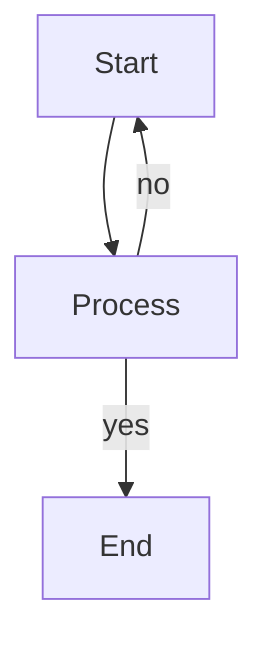

# Mermaid Guidelines (ASCII-safe)

This document shows clear, portable, and consistent rules for writing Mermaid.js diagrams in Markdown files for this project.

---

## Basic Rules

1. **ASCII-safe only**

   * Avoid symbols like `≥`, `→`, `×`, `÷`, `±`, `®`, `…`, etc.
   * Use only ASCII characters for maximum compatibility across terminals and GitHub.

2. **Text Style**

   * Use lowercase for code terms: `center_x`, `y_ref`
   * Use `and` instead of slashes (`/`) when meaning conjunction
   * Use `or` when describing options, never `/`

3. **Operators**

   * Replace:

     | Unicode | ASCII-safe        |
     | ------- | ----------------- |
     | `≥`     | `>=`              |
     | `≤`     | `<=`              |
     | `→`     | `->`              |
     | `×`     | `*` or `x`        |
     | `÷`     | `/`               |
     | `±`     | `+/-`             |
     | `…`     | `...`             |
     | `®`     | `&reg;` (escaped) |

4. **Node Names**

   * Use short **IDs**: `A`, `B1`, `C_details`, etc.
   * Place full description in **quotes**:

     ```mermaid
     A["Binary mask"] --> B["extractLanePoints"]
     ```
   * Avoid `/`, `:`, and `&` in node IDs (they can cause Mermaid or HTML parsing errors).

5. **Subgraphs**

   * Use for grouping logical blocks like functions:

     ```mermaid
     subgraph A_details ["Inside Function A"]
     ...
     end
     ```

6. **Arrows and Labels**

   * Use `-->` for normal flow
   * Use `-- yes -->`, `-- no -->` for conditions
   * Use `-.->` for optional/dashed links

7. **Escaping HTML (if needed)**
   Use HTML entities:

   | Symbol | Entity   |
   | ------ | -------- |
   | `&`    | `&amp;`  |
   | `<`    | `&lt;`   |
   | `>`    | `&gt;`   |
   | `"`    | `&quot;` |

   Especially when text like `&reg;`, `&value` appear in labels.

8. **Use `<br/>` for multi-line nodes**

   ```mermaid
   A["Line 1<br/>Line 2"]
   ```

9. **Avoid math syntax unless escaped**
   GitHub may misinterpret `/`, `*`, or brackets.

   * Prefer: `x_left at y_ref` instead of `x_left(y_ref)`
   * Use: `average(xL, xR)` or `center = (xL + xR) / 2`

10. **Use Mermaid Live Editor to validate**

* [https://mermaid.live](https://mermaid.live)

---

## Example



---
