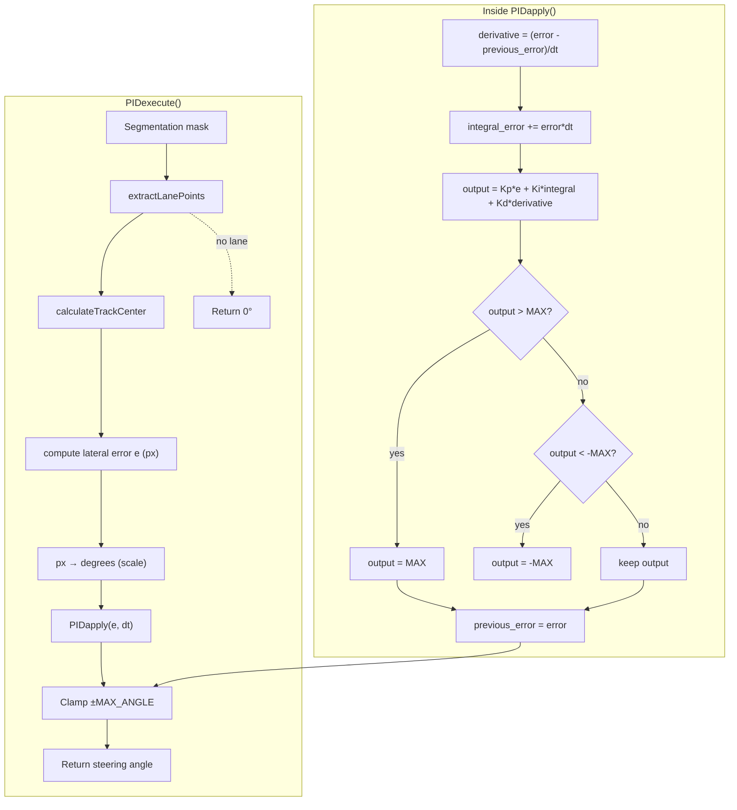

# `pid_controller` module – `jetracer::pid`

This module implements a **PID controller (Proportional‑Integral‑Derivative)** used to correct the **lateral error** computed by the `computer_vision` module. It translates the vehicle's deviation from the center of the lane into a **limited steering angle** compatible with the JetRacer's servo.

---

## Data Structure

| Type        | Field            | Description                               |
| ----------- | ---------------- | ----------------------------------------- |
| `PIDStatus` | `integral_error` | Accumulated error sum (the **I** term)    |
|             | `previous_error` | Error from the previous step (**D** term) |

> Store **one instance per controller** to retain internal state across calls.

---

## Constants (Gains & Limits)

| Constant          | Value   | Role                                              |
| ----------------- | ------- | ------------------------------------------------- |
| `Kp`              | `1.5f`  | Proportional gain (**P**)                         |
| `Ki`              | `0.1f`  | Integral gain (**I**)                             |
| `Kd`              | `0.2f`  | Derivative gain (**D**)                           |
| `MAX_ANGLE`       | `140°`  | Saturation of output command (servo-safe range)   |
| `displacement_cm` | `25 cm` | Physical lane width, used for px-to-cm conversion |

*All are `constexpr`; adjust as needed based on your vehicle geometry.*

---

## Public Functions

### 1. `float PIDapply(float error, float dt, PIDStatus &status);`

Computes the PID output for a given instantaneous error.

| Parameter | Description                            |
| --------- | -------------------------------------- |
| `error`   | Current error (in pixels or degrees)   |
| `dt`      | Time since last computation (seconds)  |
| `status`  | Internal state (integral / derivative) |

**Returns:** Clamped correction angle in the range $\[-`MAX_ANGLE`, `MAX_ANGLE`]\$.

#### Formula used:

$$
\text{output} = K_p \cdot e + K_i \cdot \int e \cdot dt + K_d \cdot \frac{de}{dt}
$$

(*Sign inversion is applied inside `PIDapply` according to the project convention.)*

---

### 2. `float PIDexecute(const cv::Mat &original_frame, const std::string &base_name);`

All-in-one pipeline: receives a **pre-segmented lane mask**, applies vision to detect the lane center, runs the PID controller, and returns the steering angle.

| Parameter        | Description                                                   |
| ---------------- | ------------------------------------------------------------- |
| `original_frame` | **1-channel** (binary) image mask from the camera             |
| `base_name`      | Name used when saving overlay image into `outputs/` directory |

**Internal steps:**

1. Clones the input image, sets `image_center` and `scale`.
2. Calls `extractLanePoints` to detect left/right lane lines.
3. Computes lane center using `calculateTrackCenter`.
4. Converts lateral error to degrees and applies `PIDapply` with fixed `dt = 0.1 s`.
5. Draws the debug overlay and saves image to `outputs/<base_name>.png`.
6. Displays result using OpenCV window.

**Returns:** Clamped steering angle (degrees). Returns `0.0f` if no lane is detected.

---

## PID Tuning Guidelines

1. **P gain** – Start here; increase to improve response speed (watch for overshoot).
2. **D gain** – Add to reduce overshoot and smooth out sudden corrections.
3. **I gain** – Only for eliminating steady-state error (e.g., misalignment). Keep low to avoid wind-up.
4. **MAX\_ANGLE** – Protects hardware; ensures servo stays within safe range.

You can use **MATLAB Control Toolbox** or empirical methods (e.g., Ziegler–Nichols). Export logs (`CSV`) with `error` and `output` for post-run analysis.

---

## Flow

## Notes & Best Practices

* The input frame **must be pre-segmented** (see `computer_vision` module).
* `PIDexecute` uses a **fixed `dt = 0.1s`**. For real-time sampling, consider measuring real `dt` per frame.
* The I term is not anti-wind-up protected. You may want to clamp `integral_error` manually.
* Use **threads**, **ROS**, or timers to maintain a stable loop across camera capture, PID, and motor control.

